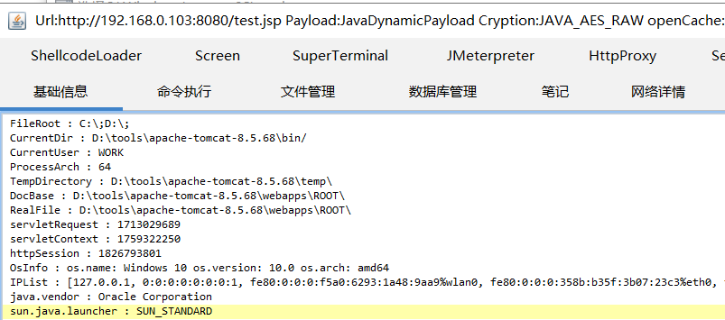
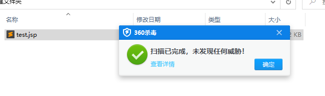
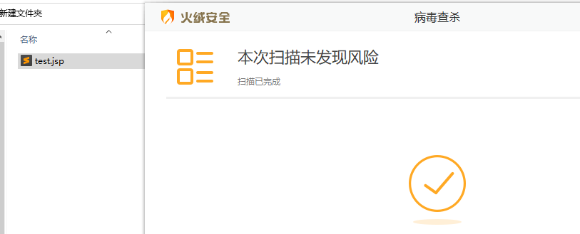
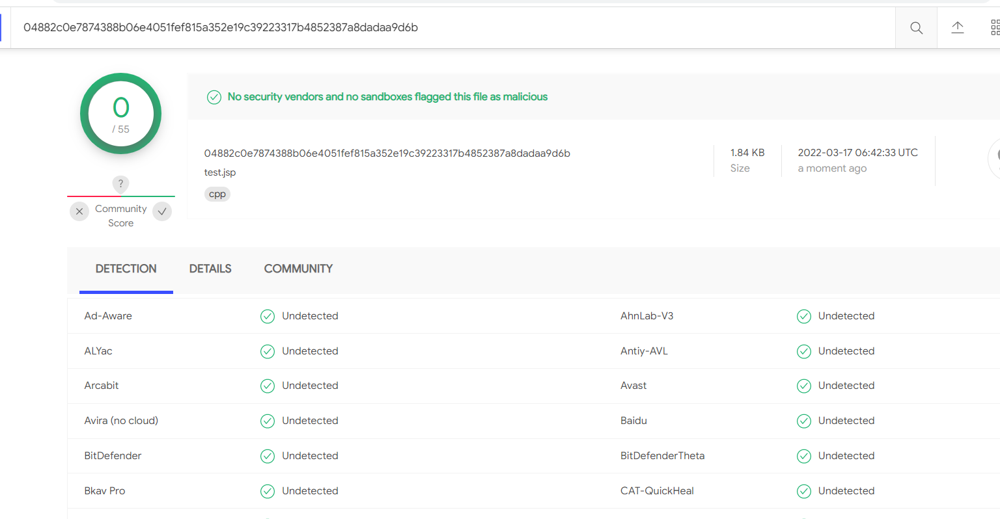
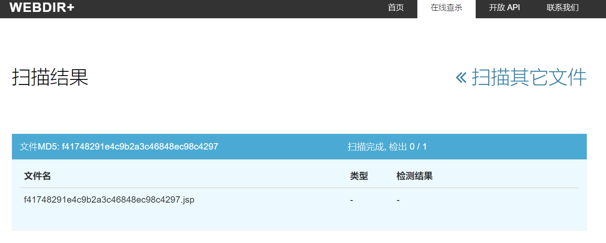

>在 GBByPass 的基础上增加了自定义冰蝎和一句话密码的功能
https://github.com/czz1233/GBByPass


```
*************************警 告*****************************
本工具旨在帮助企业快速定位漏洞修复漏洞,仅限授权安全测试使用!
严格遵守《中华人民共和国网络安全法》,禁止未授权非法攻击站点!
***********************************************************

1、Godzilla java_aes_raw 连接默认密码为: 1
2、Behinder默认密码为: baihua666
3、生成绕不过阿里云检测 http://XXX:8080/xxx.jsp?baihua666=whoami

[*] 输入密码或回车(使用默认值): P#xdd5d
[*] 一句话、冰蝎, 密码为: P#xdd5d

[+] 输入 '1' 生成Godzilla;
[+] 输入 '2' 生成Behinder;
[+] 输入 '3' 生成绕不过阿里云检测一句话：
2
[*] 生成中... 密码： P#xdd5d
[+] Succussfully
```


# GBByPass
冰蝎 哥斯拉 webshell bypass 原理通过Unicode编码绕过关键字
# 更新哥斯拉
## 哥斯拉效果图

## 360 

## 火绒

## virustotal

## webdir+



## Stargazers over time

[](https://starchart.cc/h0nayuzu/WebshellBypass)